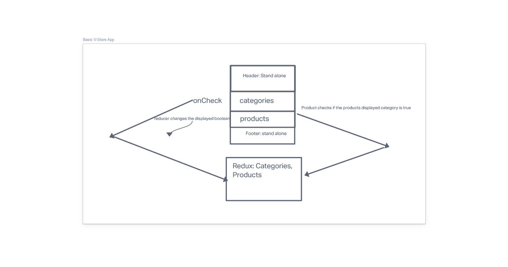
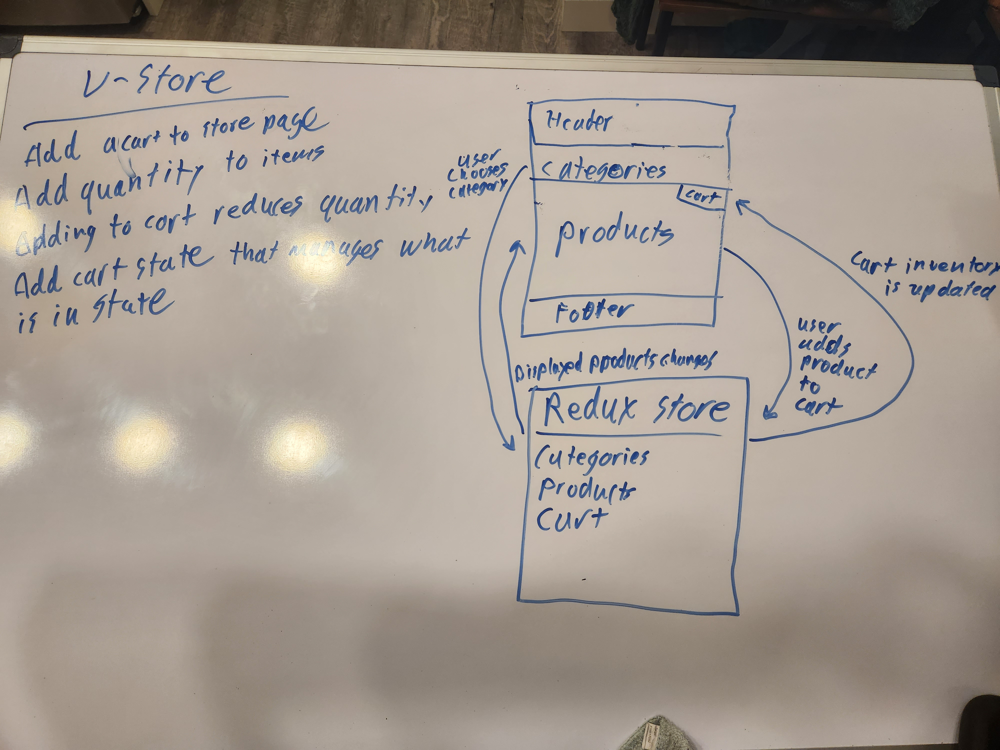

# Lab 36  

## UML  

## Approach  

Styled the app using some material UI components. The checkboxes are generated from the list of categories in the store. Unchecking a checkbox filters out unwanted items. All of the displayed products are displayed with the card components from material UI.  

## Lab 37  

## UML  

  

## Approach  

Added an add to cart button and a cart component to store those items. Split reducers into multiple files, and utilized the combine reducers function to bring them into react.  

Live deploy: https://leafy-hotteok-c327f9.netlify.app/  
README: https://github.com/AdrianCosme5850/v-store#readme  
